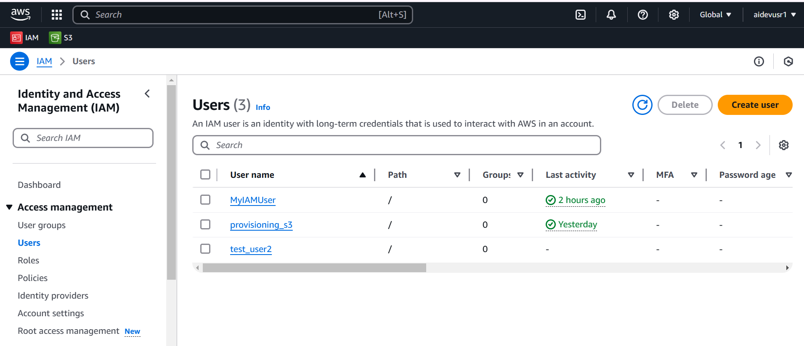
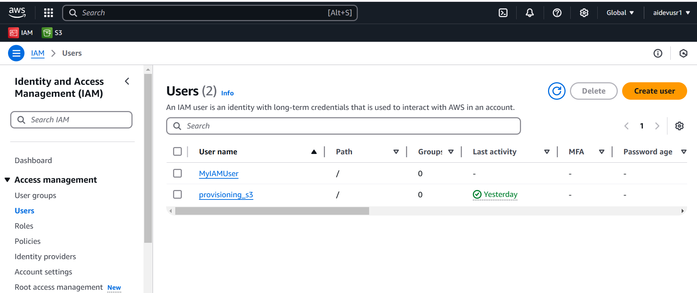

# S3 Bucket Creation 

Amazon S3 (Simple Storage Service) is a scalable storage service that allows users to store and retrieve any amount of data from anywhere on the web.

## 1. Prerequisites  
Before creating an S3 bucket, ensure you have:  
- An **AWS account**  
- **AWS CLI** installed and configured (`aws configure`)  
- **Python** installed (`python --version` to check)  
- **Boto3** installed (`pip install boto3`)  


### Use Cases
- **Data Backup and Restore**
- **Big Data Analytics**
- **Static Website Hosting**
- **Log Storage and Analysis**

This document contains a Python script to create an S3 bucket using the AWS SDK for Python (boto3).

## Files

- `create_s3.py`: The main script to create an S3 bucket.

## Usage

### Using the Python Script

1. Install the required dependencies:
```sh
pip install boto3
```

2. Run the script:
```sh
python create_s3.py
```
```
import boto3

def create_s3_bucket(bucket_name, region="us-east-1"):
    s3_client = boto3.client("s3", region_name=region)
    try:
        if region == "us-east-1":
            s3_client.create_bucket(Bucket=bucket_name)
        else:
            s3_client.create_bucket(
                Bucket=bucket_name,
                CreateBucketConfiguration={"LocationConstraint": region},
            )
        print(f"Bucket '{bucket_name}' created successfully in {region}.")
    except Exception as e:
        print(f"Error: {e}")

if __name__ == "__main__":
    bucket_name = "data1233027"
    create_s3_bucket(bucket_name)
 ```



### AWS S3 Bucket Creation Using AWS CLI
#### Step 1: Configure AWS CLI ####

 Run the following command and enter your credentials when prompted:

```sh
aws configure
AWS Access Key ID
AWS Secret Access Key
Default region name (e.g., us-east-1)
Default output format (press Enter to use the default json)
```

#### Step 2: Create an S3 Bucket ####
Once configured, create the S3 bucket using:

```sh
aws s3 mb s3://data2122026 --region us-east-1
```


#### Configuration

- The script uses the default AWS credentials and configuration. Make sure your AWS credentials are configured properly.
- You can change the [bucket_name](http://_vscodecontentref_/2) and [region](http://_vscodecontentref_/3) parameters in the script as needed.


# AWS IAM User Creation Guide  
- AWS IAM (Identity and Access Management) is a service that helps you securely manage access to AWS resources. It allows you to create and control users, groups, roles, and permissions in AWS.

## 1. Prerequisites  
Before you begin, make sure you have:  
- AWS CLI installed and configured  
- Python and Boto3 installed (`pip install boto3`)  
- Necessary IAM permissions to create users  

---

## 2. Create IAM User Using AWS CLI  
Run the following command to create an IAM user:  

```sh
aws iam create-user --user-name MyIAMUser

```



## 3. Using Python (boto3)  

2. Run the script:
```sh
python create_IAM.py
```
```

import boto3
import json

class AWSIAMManager:
    def __init__(self, region="us-east-1"):
        self.iam_client = boto3.client("iam", region_name=region)

    def create_iam_user(self, user_name):
        """Creates an IAM user."""
        try:
            response = self.iam_client.create_user(UserName=user_name)
            print(f"User '{user_name}' created successfully.")
            return response
        except self.iam_client.exceptions.EntityAlreadyExistsException:
            print(f"User '{user_name}' already exists.")
            return None

    def attach_inline_policy(self, user_name, policy_name, policy_document):
        """Attaches an inline policy to the IAM user."""
        try:
            self.iam_client.put_user_policy(
                UserName=user_name,
                PolicyName=policy_name,
                PolicyDocument=json.dumps(policy_document)
            )
            print(f"Inline policy '{policy_name}' attached to user '{user_name}' successfully.")
        except Exception as e:
            print(f"Error attaching inline policy: {e}")

    def attach_managed_policy(self, user_name, policy_arn):
        """Attaches a managed policy to the IAM user."""
        try:
            self.iam_client.attach_user_policy(
                UserName=user_name,
                PolicyArn=policy_arn
            )
            print(f"Managed policy '{policy_arn}' attached to user '{user_name}' successfully.")
        except Exception as e:
            print(f"Error attaching managed policy: {e}")

# AWS Configuration
AWS_REGION = "us-east-1"
USER_NAME = "test_user2"  # Creating only test_user2
INLINE_POLICY_NAME = "S3WriteOnlyPolicy"
MANAGED_POLICY_ARN = "arn:aws:iam::aws:policy/AmazonS3ReadOnlyAccess"

# Inline policy document
INLINE_POLICY_DOCUMENT = {
    "Version": "2012-10-17",
    "Statement": [
        {
            "Effect": "Allow",
            "Action": [
                "s3:GetObject",
                "s3:ListBucket"
            ],
            "Resource": "*"
        }
    ]
}

def main():
    iam_manager = AWSIAMManager(region=AWS_REGION)

    # Create IAM user
    iam_manager.create_iam_user(USER_NAME)

    # Attach inline policy
    iam_manager.attach_inline_policy(USER_NAME, INLINE_POLICY_NAME, INLINE_POLICY_DOCUMENT)

    # Attach managed policy
    iam_manager.attach_managed_policy(USER_NAME, MANAGED_POLICY_ARN)

if __name__ == "__main__":
    main()

```  
