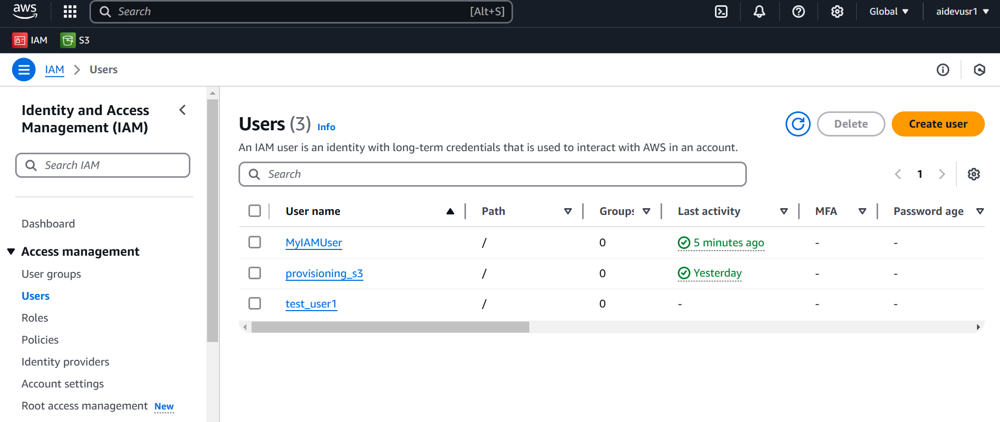
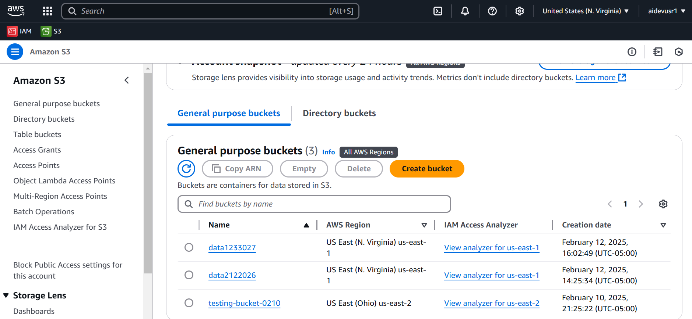

# S3 Bucket Creation Script

This project contains a Python script to create an S3 bucket using the AWS SDK for Python (boto3).

## Files

- `create_s3.py`: The main script to create an S3 bucket.

## Usage

### Using the Python Script

1. Install the required dependencies:
    ```sh
    pip install boto3
    ```

2. Run the script:
    ```sh
    python create_s3.py
    ```
```import boto3

def create_s3_bucket(bucket_name, region="us-east-1"):
    s3_client = boto3.client("s3", region_name=region)
    try:
        if region == "us-east-1":
            s3_client.create_bucket(Bucket=bucket_name)
        else:
            s3_client.create_bucket(
                Bucket=bucket_name,
                CreateBucketConfiguration={"LocationConstraint": region},
            )
        print(f"Bucket '{bucket_name}' created successfully in {region}.")
    except Exception as e:
        print(f"Error: {e}")

if __name__ == "__main__":
    bucket_name = "data1233027"
    create_s3_bucket(bucket_name) ```

### Using the AWS CLI

1. Make sure you have the AWS CLI installed and configured with your credentials.
2. Run the following command to create an S3 bucket:
    ```sh
    aws s3 mb s3://data1222025 --region us-east-1
    ```

## Configuration

- The script uses the default AWS credentials and configuration. Make sure your AWS credentials are configured properly.
- You can change the [bucket_name](http://_vscodecontentref_/2) and [region](http://_vscodecontentref_/3) parameters in the script as needed.

## Example

To create a bucket named `data1233027` in the `us-east-1` region using the Python script, run:
```sh
python create_s3.py
